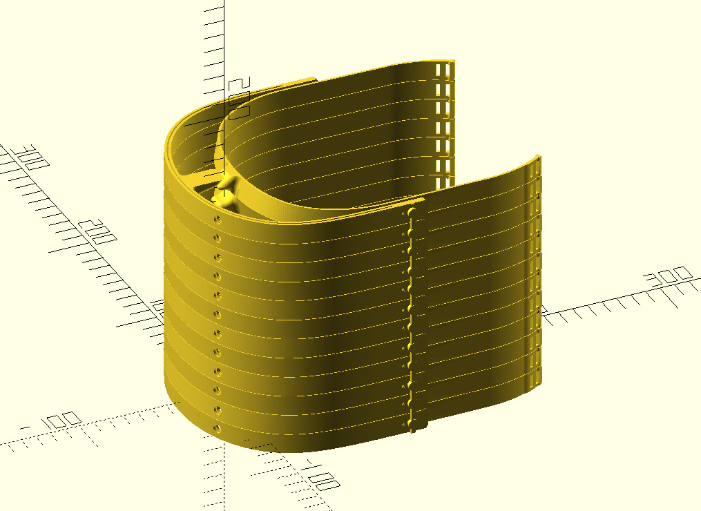

# facemask-print-vertical

Designs available:

- The A mask homologated in a hospital in Madrid
  - Original B1 part
  - Stacked B2 part homologated in a hospital in Madrid
  - The full A mask but WITHOUT the top covers

- Stacked Prusa main part

## Please open an issue if you have any requests

Stacked with OpenScad software, the code is available in the "source_code" directory.

