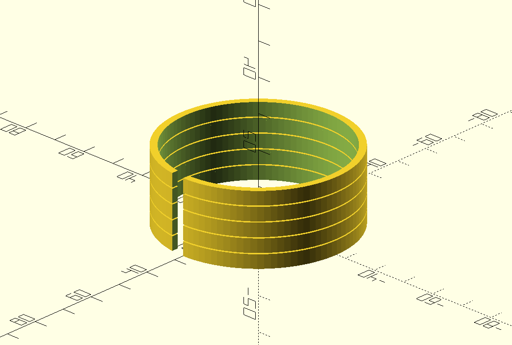

# facemask-print-vertical

Designs available:

- Stacked: Prusa mask main part

- Stacked: Protective visor by 3dverkstan

- The A mask homologated in a hospital in Madrid (unfortunately I cannot recommend the design, simpler is better, so avoid this one)
  - Original B1 part
  - Stacked: B2 part

There is one empty layer between each part to allow an easy separation. Support material not needed.

Hay una capa vacía entre cada pieza, lo que permite separarlas fácilmente. No es necesario material de soporte.

## Check the Z layers before printing to ensure there is exactly one layer missing between each part

## First adjust your setup with the calibration example:

https://github.com/CarlosGS/facemask-print-vertical/tree/master/source_code/adhesion_test

Altura de capa sugerida / suggested layer height: 0.3-0.4 mm

## Please open an issue if you have any requests

Stacked with OpenScad software, the code is available in the "source_code" directory.

