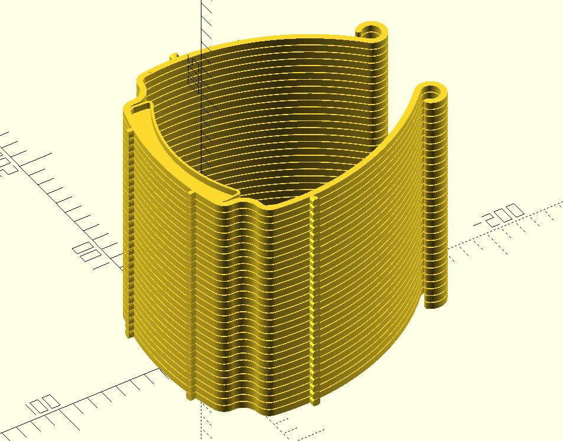

# Stack and print multiple copies (easy separation!)

Tutorial to generate your own models:

- They need to be flat on top and bottom
- Open the stack.scad file using https://www.openscad.org/
- Edit the variables (model thickness, separation, etc)
- Compile the model using F5 to preview until all looks OK
- Render with F6 and export the STL file.

Tested with [this cura profile](https://github.com/MKme/I3-Mega-3D-Printer-Settings-Resources/blob/master/Cura%20Profiles/i3%20Mega%20Erics%20Main%20Profile.curaprofile) (see [the result](https://twitter.com/MKmeOrg/status/1243522985262186496) ). I suggest to **first try with your own profile and layer height 0.3mm**. Normally there is NO need for support material.

## Check the Z layers before printing to ensure there is exactly one layer missing between each part

## First adjust your setup with the calibration example:

https://github.com/CarlosGS/facemask-print-vertical/tree/master/source_code/adhesion_test

#### The example used is https://3dverkstan.se/protective-visor/ by 3dverkstan. More files are [here](https://github.com/CarlosGS/facemask-print-vertical/tree/master/stl)

